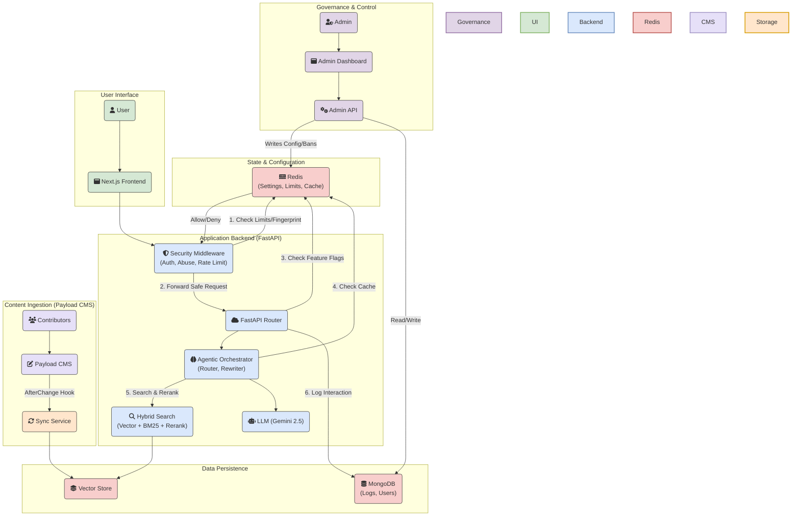

# **Litecoin Knowledge Hub**

## **Project Overview**

The Litecoin Knowledge Hub is an AI-powered conversational tool designed to serve the Litecoin community by providing real-time, accurate answers to a wide range of questions. Its core strength lies in its **Agentic Retrieval-Augmented Generation (RAG) pipeline**, which retrieves information from a human-vetted, curated knowledge base managed by the Litecoin Foundation through **Payload CMS**.

This project's value is not in competing with general-purpose AI models like ChatGPT or Grok, but in providing a specialized, high-accuracy information utility for the Litecoin ecosystem. By grounding responses in a canonical, trusted knowledge base, it aims to combat misinformation, enhance user experience, foster greater adoption, and provide a single, trustworthy source for everything related to Litecoin.

**Target Users/Audience:** Litecoin users (novice and experienced), cryptocurrency enthusiasts, developers building on Litecoin, and potential adopters seeking reliable information.

## **Project Status: ✅ Phase 1 Complete**

The project has successfully completed the implementation of the core RAG pipeline and backend services. The system utilizes an **advanced Agentic RAG architecture** featuring canonical intent rewriting, hybrid search (Vector + BM25), and sparse re-ranking. The **Payload CMS integration is fully operational** with complete content lifecycle management (draft → publish → unpublish → delete) and real-time synchronization. **Comprehensive monitoring infrastructure** (Prometheus, Grafana) and **question logging** have been implemented to track system performance and user queries. The system is production-ready with robust abuse prevention, cost controls, and security hardening. The Litecoin Foundation announced the project on November 7, 2025, and crowdfunding is underway for final UI polish and integration into litecoin.com.

## **Key Features & User Stories**

* **Primary Goals:**  
  * Deliver accurate, real-time responses to Litecoin-related queries.  
  * Simplify user access to Litecoin information, reducing reliance on fragmented or unverified sources.  
  * Increase user engagement and trust in the Litecoin ecosystem through reliable, conversational support.

| Feature Area | Description |
| :---- | :---- |
| **Agentic Query Understanding** | ✅ **IMPLEMENTED** - Uses a semantic router to rewrite ambiguous user queries into "Canonical Intents" (e.g., resolving "How does *it* work?" to "How does *MWEB* work?"). This ensures high-accuracy retrieval even for poorly phrased questions. |
| **Advanced Hybrid Retrieval** | ✅ **IMPLEMENTED** - Combines **Infinity Vector Search** (semantic) with **BM25** (keyword) and uses **Sparse Re-ranking** to order results. Implements the **Parent Document Pattern** to match against small FAQ chunks but retrieve full context for the LLM. |
| **Conversational Memory** | ✅ **IMPLEMENTED** - Enables natural follow-up conversations with context-aware responses, allowing users to ask questions like "Who created it?" or "What about the second one?" that reference previous conversation context. |
| **Payload CMS Integration** | ✅ **IMPLEMENTED** - Complete content lifecycle management system with draft→publish→unpublish→delete workflows, real-time webhook synchronization, automated content filtering, and Foundation-controlled editorial oversight ensuring knowledge base quality and accuracy. |
| **Monitoring & Observability** | ✅ **IMPLEMENTED** - Comprehensive monitoring infrastructure with Prometheus metrics, Grafana dashboards, health checks, structured logging, and LLM observability (LangSmith integration). Tracks RAG pipeline performance, LLM costs, cache performance, and system health. |
| **Question Logging** | ✅ **IMPLEMENTED** - All user questions are logged to MongoDB for analysis, enabling insights into user needs, query patterns, and system usage. Questions are accessible via direct MongoDB queries for internal analysis. |
| **LLM Spend Limit Monitoring** | ✅ **IMPLEMENTED** - Multi-layered cost control system with daily/hourly spend limits, pre-flight cost estimation, Prometheus metrics, and Discord alerting. Prevents billing overages with hard stops. Cost estimates: $800/million questions (without cache), $300/million questions (with cache). See [FEATURE_SPEND_LIMIT_MONITORING.md](./docs/features/FEATURE_SPEND_LIMIT_MONITORING.md) for details. |
| **Suggested Question Caching** | ✅ **IMPLEMENTED** - Redis-based cache layer for suggested questions with 24-hour TTL, pre-populated on startup, providing instant responses (<100ms) for common questions. See [FEATURE_SUGGESTED_QUESTION_CACHING.md](./docs/features/FEATURE_SUGGESTED_QUESTION_CACHING.md) for details. |
| **Security Hardening** | ✅ **COMPLETE** - Comprehensive security review and hardening completed. All critical/high vulnerabilities resolved including webhook authentication, CORS configuration, error disclosure fixes, rate limiting, and security headers. All public launch blockers resolved. Multi-layered abuse prevention stack with rate limiting, challenge-response fingerprinting, bot protection, input sanitization, and cost throttling. See [ABUSE_PREVENTION_STACK.md](./docs/security/ABUSE_PREVENTION_STACK.md) for complete documentation and [RED_TEAM_ASSESSMENT_COMBINED.md](./docs/security/RED_TEAM_ASSESSMENT_COMBINED.md) for security audit details. |
| **Litecoin Basics & FAQ** | ✅ **IMPLEMENTED** - Provides clear, concise answers to fundamental questions about Litecoin, its history, how it works, and common terminology. Caters especially to new users. Content population complete. |
| **Search Grounding** | ✅ **IMPLEMENTED** - When the curated knowledge base lacks sufficient information, the system automatically supplements answers with live web search results via Google Search, clearly flagged to the user. Powers a knowledge gap flywheel that surfaces missing topics for editorial review. |
| **Follow-Up Questions** | ✅ **IMPLEMENTED** - AI-generated contextual follow-up questions appear after each response, enabling guided exploration of Litecoin topics. |
| **Transaction & Block Explorer** | ✅ **IMPLEMENTED** - Live lookups for Litecoin transactions, addresses, blocks, fees, mempool status, and network stats via the Litecoin Space API. Includes dedicated frontend data cards and graceful error handling for invalid lookups. |
| **Market Data & Insights** | ✅ **IMPLEMENTED** - Real-time Litecoin price (USD, EUR, GBP, AUD, JPY) and network statistics (hashrate, difficulty, difficulty adjustment progress) from the Litecoin Space API with freshness timestamps. |
| **Developer Documentation** | 📝 **PLANNED** - Provides quick access to snippets from Litecoin developer documentation and technical resources. |
| **Curated Knowledge Base** | ✅ **IMPLEMENTED** - A continuously updated library of well-researched articles and data serving as the primary source for the chatbot's answers. Managed through Payload CMS. |

## **Project Roadmap**

### **Phase 1: MVP Core Foundation** ✅ **Complete**

*The goal of this phase is to launch a functional, reliable chatbot based on a trusted, human-vetted knowledge base managed with professional editorial controls.*

* ✅ **Foundation Editorial Control:** Implemented Payload's role-based system where community contributors create drafts and the Foundation team controls publishing decisions.  
* ✅ **Flexible Content Structuring:** Leveraged Payload's customizable content types (collections) to structure data for optimal RAG performance.  
* ✅ **Real-time Synchronization:** Established afterChange hook-based synchronization between Payload CMS and the RAG pipeline for immediate content updates.  
* ✅ **Monitoring Infrastructure:** Implemented comprehensive monitoring with Prometheus metrics, Grafana dashboards, health checks, and structured logging.  
* ✅ **Question Logging:** Implemented user question logging system for analytics and insights.  
* ✅ **Initial Launch Content:** Populated Payload CMS with comprehensive Litecoin knowledge base content.  
* ✅ **Production Deployment:** Deployed the frontend (Next.js), backend (FastAPI), and Payload CMS applications to their respective hosted services.

### **Phase 2: User Experience & Accuracy Enhancements (Post-MVP)**

*The goal of this phase is to increase user trust, engagement, and the precision of the RAG pipeline.*

* **Conversational Memory & Context:** ✅ **COMPLETED** - Implemented history-aware retrieval using LangChain conversational chains to retain conversation history, enabling natural follow-up questions with context-aware responses.

* **Upgraded Retrieval Engine (Agentic RAG):** ✅ **COMPLETED** - Implemented a state-of-the-art retrieval pipeline featuring:

    * **Semantic Router:** Determines if a query needs history or can be answered via cache.

    * **Canonical Intent Rewriting:** Transforms ambiguous inputs into standalone search queries.

    * **Hybrid Search:** Combines Infinity Vector Embeddings with BM25 Keyword search.

    * **Sparse Re-ranking:** Uses BGE-M3/Infinity to re-rank documents for maximum relevance.

* **Trust & Transparency (Source Citations):** Implement in-line citations in AI responses, linking directly to source documents.

* **Contextual Discovery (AI-Generated Follow-up Questions):** ✅ **COMPLETED** - Generate relevant, clickable follow-up questions after each response.

* **Search Grounding (Knowledge Gap Filling):** ✅ **COMPLETED** - Automatic web search supplementation when the curated knowledge base lacks coverage, with a flywheel that surfaces gaps for editorial review.

* **User Feedback Loop:** Introduce a mechanism for users to provide direct feedback on AI answer quality.

### **Phase 3: Live Data & Developer Integrations (Post-MVP)**

*The goal of this phase is to expand the chatbot's capabilities by integrating real-time data sources and specialized developer tools.*

* **Transaction & Block Explorer:** ✅ **COMPLETED** - Live lookups for transactions, addresses, blocks, fees, mempool, and network stats via the Litecoin Space API with dedicated frontend data cards.
* **Market Data & Insights:** ✅ **COMPLETED** - Real-time price data (USD, EUR, GBP, AUD, JPY) and network statistics (hashrate, difficulty) from the Litecoin Space API.
* **Developer Documentation & Resources:** Ingest and provide quick access to Litecoin developer documentation.

## **Architectural Overview**

The architecture is a production-grade platform organized around three primary workflows: Content Ingestion (Knowledge Base), User Query Processing (Agentic RAG Pipeline), and System Governance (Dynamic Configuration & Security).

**Content Ingestion:** Managed via Payload CMS, where verified contributors author content that is automatically synced, chunked, and embedded into the vector store.

**User Query Processing:** An **Agentic RAG pipeline** that prioritizes accuracy and safety. Requests pass through an Abuse Prevention Middleware before entering the pipeline:

1.  **Sanitization:** Inputs are scrubbed for prompt injection.

2.  **Routing:** A semantic router determines if the query is a greeting, a follow-up, or a new topic.

3.  **Intent Classification:** Detects blockchain data queries (transactions, addresses, blocks, fees, mempool, hashrate, price) and routes them to the **Litecoin Space API** for live data with structured frontend cards.

4.  **Rewriting:** The system rewrites the query into a "Canonical Intent" to optimize cache hits and search accuracy.

5.  **Retrieval:** A hybrid engine searches vector and keyword indices, then re-ranks results using sparse embeddings.

6.  **Search Grounding:** When the knowledge base lacks sufficient context, the system supplements answers with Google Search results, flagged to the user, and logs the gap for editorial review.

**System Governance:** A dedicated Admin Dashboard and API that allows operators to control system behavior (spend limits, maintenance mode, user bans) in real-time via Redis, without requiring code deployments.

Redis serves as the central nervous system, acting not just as a cache, but as the authoritative state store for dynamic settings and rate limit counters.

The project consists of 9 services: mongodb, backend, payload_cms, frontend, prometheus, grafana, admin_frontend, cloudflared, and redis. All configured with health checks, restart policies, and dependencies.



## **Major Milestones & Timelines**

*(Timelines to be determined)*

| Status | Milestone | Focus |
| --- | --- | --- |
| ✅ | **[M1: Project Initialization](./docs/milestones/milestone_1_project_initialization.md)** | Core documentation and project setup. |
| ✅ | **[M2: Basic Project Scaffold](./docs/milestones/milestone_2_basic_project_scaffold.md)** | Initial Next.js frontend and FastAPI backend. |
| ✅ | **[M3: Core RAG Pipeline](./docs/milestones/milestone_3_core_rag_pipeline.md)** | Implemented data ingestion, vector search, and generation. |
| ✅ | **[M4: Litecoin Basics & FAQ](./docs/milestones/milestone_4_litecoin_basics_faq.md)** | CRUD API for data sources and full ingestion of initial FAQ knowledge base. |
| ✅ | **[M5: Payload CMS Setup & Integration](./docs/milestones/milestone_5_payload_cms_setup_integration.md)** | Configure self-hosted Payload CMS and integrate its API and webhooks with the backend. |
| ✅ | **[M6: MVP Content Population](./docs/milestones/milestone_6_mvp_content_population_validation.md)** | Populate Payload with the complete "Litecoin Basics & FAQ" knowledge base. |
| ✅ | **[M7: MVP Testing & Deployment](./docs/milestones/milestone_7_mvp_testing_refinement_deployment.md)** | Conduct comprehensive testing, refine UI, and execute initial production deployment. |
| 📝 | **[M8: Implement Trust & Feedback Features](./docs/milestones/milestone_8_implement_trust_feedback_features.md)** | Implement features from Phase 2 (UX/Accuracy). |
| ✅ | **[M9: Implement Contextual Discovery](./docs/milestones/milestone_9_implement_contextual_discovery.md)** | **COMPLETED** - Follow-up questions and search grounding implemented. |
| ✅ | **[M10: Upgrade Retrieval Engine](./docs/milestones/milestone_10_upgrade_retrieval_engine.md)** | **COMPLETED** - Hybrid search and re-ranking deployed. |
| ✅ | **[M11: Transaction & Block Explorer](./docs/milestones/milestone_11_transaction_block_explorer.md)** | **COMPLETED** - Litecoin Space API integration with live data cards. |
| ✅ | **[M12: Market Data & Insights](./docs/milestones/milestone_12_market_data_insights.md)** | **COMPLETED** - Price and network stats from Litecoin Space API. |
| 📝 | **[M13: Developer Documentation](./docs/milestones/milestone_13_developer_documentation.md)** | Implement features from Phase 3 (Live Data). |

## **Technology Stack**

For more details, see cline_docs/techStack.md.

* **Frontend:** Next.js, TypeScript, Tailwind CSS
* **Backend:** Python, FastAPI, LangChain (LCEL, Conversational Chains, History-Aware Retrieval)
* **AI/LLM:** Gemini Flash 2.5 Lite (for generation)
* **Embeddings:** Infinity (providing sentence-transformers/all-MiniLM-L6-v2) - Runs locally for dense vectors and sparse embeddings
* **Content Management:** Payload CMS (self-hosted)
* **Database:** MongoDB, MongoDB Atlas Vector Search / FAISS (hybrid for local development)
* **Monitoring:** Prometheus, Grafana, LangSmith (optional LLM tracing)
* **Deployment:** Vercel (Frontend), Railway/Render/Fly.io (Backend), Vercel/Docker (Payload CMS)
* See [DEPLOYMENT.md](./docs/DEPLOYMENT.md) for detailed deployment instructions
* See [monitoring/README.md](./monitoring/README.md) for monitoring setup

## **Directory Structure**

```
.
├── backend/            # FastAPI, LangChain, RAG logic
├── frontend/           # Next.js user interface
├── admin-frontend/     # Next.js admin interface for system management
├── payload_cms/        # Self-hosted CMS & Knowledge Base
├── docs/               # Project documentation
├── monitoring/         # Prometheus & Grafana configuration
├── scripts/            # Utility scripts for development & deployment
├── docker-compose.dev.yml          # Development environment
├── docker-compose.prod-local.yml   # Local production build verification
└── docker-compose.prod.yml         # Production environment
```

## **Getting Started**

### **Prerequisites**

* Node.js v18.18.0+
* Python 3.x
* Local MongoDB instance (optional, for document persistence)
* FAISS (automatically installed via pip)

### **Local Development Setup**

#### Vector Store Configuration

For local development, the backend uses FAISS vector store instead of MongoDB Atlas Vector Search. This provides faster setup and doesn't require an Atlas cluster.

1. **Install and Start MongoDB:**

```bash
# Using Homebrew
brew install mongodb/brew/mongodb-community
brew services start mongodb-community

# Or using Docker
docker run -d --name mongodb -p 27017:27017 mongo:latest

```

2. **Configure Environment Variables:**

The project uses a centralized environment variable system. See [docs/setup/ENVIRONMENT_VARIABLES.md](./docs/setup/ENVIRONMENT_VARIABLES.md) for complete documentation.

For local development:

```bash
# Copy the template
cp .env.example .env.local

# Create service-specific .env files for secrets
echo "GOOGLE_API_KEY=your-key-here" > backend/.env
echo "PAYLOAD_SECRET=your-secret-here" > payload_cms/.env

```

The `.env.local` file already has localhost URLs configured. Update secrets in service-specific `.env` files.

3. **Data Persistence:**

* **Documents**: Stored in local MongoDB collections
* **Embeddings**: Stored in FAISS index files on disk
* **Index Location**: Configured via `FAISS_INDEX_PATH`

### **Running Development Servers**

1. **Frontend (Next.js):**

cd frontend
npm install
npm run dev
# Frontend available at [http://localhost:3000](http://localhost:3000)

2. **Backend (FastAPI):**

cd backend
python3 -m venv venv && source venv/bin/activate
pip install -r requirements.txt
# Ensure .env.local exists in project root (see step 2 above)
# Ensure backend/.env has GOOGLE_API_KEY
uvicorn main:app --reload
# Backend available at [http://localhost:8000](http://localhost:8000)

The backend will automatically:
* Load existing FAISS index if available
* Create new index from MongoDB documents if needed
* Save index changes to disk after updates

3. **Payload CMS (Content Management):**

cd payload_cms
# Ensure .env.local exists in project root (see step 2 above)
# Ensure payload_cms/.env has PAYLOAD_SECRET
pnpm install
pnpm dev
# Payload CMS admin panel available at [http://localhost:3001](http://localhost:3001)

**Note:** Environment variables are now managed centrally. See [docs/setup/ENVIRONMENT_VARIABLES.md](./docs/setup/ENVIRONMENT_VARIABLES.md) for details.

**Alternative: Docker Setup**
```bash
cd payload_cms
cp .env.example .env
# Update MONGO_URI in .env to: mongodb://127.0.0.1/payload_cms
docker-compose up
# Payload CMS available at <http://localhost:3001>
```

**First-Time Setup:**
* Open http://localhost:3001 in your browser
* Create your first admin user account
* Access the admin panel to manage content
* Content published here will automatically sync with the RAG pipeline

### **Local Production Build Verification**

For verifying production builds locally before deployment:

1. **Create `.env.prod-local` file** in the project root:

```bash
cp .env.example .env.prod-local

```

Update the values as needed for local production builds. See [docs/setup/ENVIRONMENT_VARIABLES.md](./docs/setup/ENVIRONMENT_VARIABLES.md) for variable documentation.

2. **Run local production build verification:**

```bash
# Using helper script (recommended)
./scripts/run-prod-local.sh

# Or manually
export $(cat .env.prod-local | xargs) && docker-compose -f docker-compose.prod-local.yml up --build

```

This runs production builds with the full stack (including monitoring) using localhost URLs. See [docs/deployment/PROD_LOCAL.md](./docs/deployment/PROD_LOCAL.md) for detailed documentation.

## **Testing**

The Litecoin Knowledge Hub has a comprehensive test suite with **121+ passing tests** across 31 test files, covering all critical functionality including the RAG pipeline, conversational memory, rate limiting, spend limits, webhook authentication, abuse prevention, local RAG services, and blockchain data integration.

### Quick Start

Run the full test suite inside the running Docker container:

```bash
# If production stack is running
docker exec litecoin-backend python -m pytest /app/backend/tests -v

# Or using docker-compose dev environment
docker compose -f docker-compose.dev.yml run --rm backend pytest tests/ -vv

```

**Expected Output**: `121 passed, 36 skipped, 30 warnings in ~40s`

### Test Coverage Summary

| Category | Passed | Description |
| --- | --- | --- |
| Abuse Prevention | 6 | Challenge-response, rate limiting, cost throttling |
| Admin Endpoints | 10 | Auth, settings, stats APIs |
| Admin Settings Integration | 11 | Dynamic Redis settings |
| Conversational Memory | 7 | Context-aware retrieval |
| Rate Limiter | 23 | Sliding window, progressive bans |
| Spend Limits | 18 | Daily/hourly limits, alerts |
| Security | 10 | HTTPS redirect, headers, CORS |
| Webhook Auth | 10 | HMAC, replay prevention |
| Local RAG Services | 22 | Router, rewriter, embeddings |
| Other | 4 | Delete fix, streaming |

### Skipped Tests (36)

Tests are skipped when optional dependencies or services aren't available:

* **Local RAG Integration (21)**: Require Ollama/Infinity/Redis Stack on localhost (services run in Docker network)
* **Rate Limiter Advanced (9)**: Require `fakeredis` package (optional)
* **Advanced Retrieval (3)**: Feature not yet implemented
* **RAG Pipeline (2)**: Require Google embeddings (incompatible with Infinity mode)
* **Admin Endpoints (1)**: Event loop test setup issue

For the complete testing guide, see [docs/TESTING.md](./docs/TESTING.md).

## **Deployment**

For detailed deployment instructions for all services (Frontend, Backend, Payload CMS, and the complete Docker production stack), see [DEPLOYMENT.md](./docs/DEPLOYMENT.md).

## **Changelog**

For a complete history of completed milestones and changes, see [CHANGELOG.md](./CHANGELOG.md).

## **Development Statistics**

* **Total Commits:** 416
* **Total Lines of Code:** ~35,000
* **Services:** 9
* **Development Time:** 53 days (as of December 18, 2025)

## **Contributing**

This project thrives on community contributions to its knowledge base via Payload CMS. The Litecoin Foundation maintains editorial control while enabling community participation. Please contact the Foundation for contributor access.

## **License**

This project is licensed under the **Creative Commons Attribution-NonCommercial-ShareAlike 4.0 International License (CC BY-NC-SA 4.0)** for all non-commercial use.

You are free to:

* Share — copy and redistribute the material in any medium or format
* Adapt — remix, transform, and build upon the material

As long as you follow the license terms:

* **Attribution** — You must give appropriate credit, provide a link to the license, and indicate if changes were made.
* **NonCommercial** — You may not use the material for commercial purposes.
* **ShareAlike** — If you remix, transform, or build upon the material, you must distribute your contributions under the same CC BY-NC-SA 4.0 license.

**Additional requirement**: Any implementation or derivative work that includes a frontend or user interface **must prominently display** the following credit (e.g., in the footer, about page, or settings): Original development by Indigo Nakamoto — x.com/indigo_nakamoto

### Commercial Use & Paid Licensing

The CC BY-NC-SA license **prohibits commercial use by third parties**.

If you wish to use this project in a for-profit product, service, company website, paid app, or any other commercial context (or remove the mandatory credit requirement), a separate commercial license is available.

Contact **Indigo Nakamoto** for commercial licensing, enterprise support, custom development, or hosted/SaaS options:

Twitter/X: [@indigo_nakamoto](https://x.com/indigo_nakamoto)
