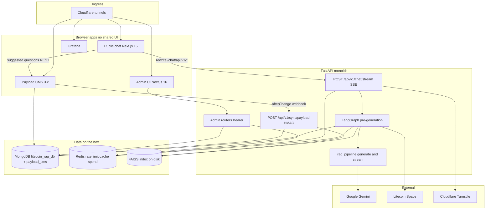
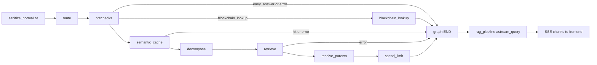

# Strangle Modernization — Ops, Health, and Graph

**Status:** Planned (spec only; not implemented)  
**Last updated:** 2026-08-21  
**Origin:** Rebuild discussion, 2026-08-19. Captured here so the plan lives in the repo, not only in chat.

A full rewrite would lose the parts that already work: LangGraph routing, HMAC CMS sync, spend limits, blockchain lookups. The higher-leverage move is a **strangle modernization** — keep the product, replace the operational and structural debt that makes the stack hard to run and hard to change.

---

## Table of Contents

1. [As-is architecture](#as-is-architecture)
2. [What is holding the system back](#what-is-holding-the-system-back)
3. [Rebuild philosophy](#rebuild-philosophy)
4. [Workstream A — Operational workflow](#workstream-a--operational-workflow)
5. [Workstream B — Health](#workstream-b--health)
6. [Workstream C — Graph and RAG structure](#workstream-c--graph-and-rag-structure)
7. [Suggested sequence](#suggested-sequence)
8. [What we will not rebuild](#what-we-will-not-rebuild)
9. [First slice](#first-slice)
10. [Build on a second machine](#build-on-a-second-machine)
11. [Success criteria](#success-criteria)

---

## As-is architecture

Five services today. No shared UI between `frontend/` and `admin-frontend/`. Chat is SSE-only. Retrieval is **FAISS on disk + MongoDB chunks**, not Atlas vector search. Generation is a sidecar after the graph, so LangSmith sees two traces.

**1. System as-is** — contracts and data/external deps. Compare this to the target ASCII in [Rebuild philosophy](#rebuild-philosophy).



**2. RAG path as-is** — 9 nodes, 3 conditional exits. Graph ends at `spend_limit`; `rag_pipeline.astream_query()` synthesizes after `graph.ainvoke()`.



Most admin already lives under `backend/api/v1/admin/`. `backend/main.py` still owns chat, health, and leftover refresh routes (`refresh-suggested-cache`, `refresh-faiss-index`).

---

## What is holding the system back

Three problems stack on top of each other.

### 1. Ops is tribal knowledge encoded in bash

`scripts/run-prod.sh` is ~500 lines of env loading, URL-encoding, interactive `read -p` prompts, and a `--no-cache` full rebuild. There are dozens of scripts and six compose files. Profiles (`monitoring`, `litecoin-integration`, `local-rag`) are implicit. There is no CI (no `.github/workflows`). `diagnose-prod.sh` checks container status, not whether the *system* can answer a question.

### 2. Health looks complete but is shallow

`/health`, `/health/live`, `/health/ready`, `/health/detailed`, Prometheus, and Grafana already exist. The checks do not match how production actually fails:

| Probe | What it does today | What it should do |
|---|---|---|
| Docker `backend` healthcheck | `curl` `/` | `/health/live` (process up) |
| `/health/ready` | Mongo `count_documents` + “is `GOOGLE_API_KEY` set?” | Cheap pings of **critical** deps |
| LLM health | Key exists | Real Gemini/Ollama call or cached last-success |
| Cache health | In-process `query_cache` | Redis + Redis Stack |
| Missing entirely | — | Infinity, Payload, Litecoin Space, optional RAG services |

Readiness that counts every vector document is both slow and the wrong signal. A missing API key is a **startup** failure, not a readiness flap. `/health/detailed` is unauthenticated.

### 3. The “brain” is still a god object

The graph in `backend/rag_graph/` is the right shape (9 nodes, 3 conditional exits — see [As-is architecture](#as-is-architecture)):

```
sanitize → route → prechecks → (early / blockchain / semantic_cache)
         → decompose → retrieve → parents → spend → END
```

Generation, flags, rewriting leftovers, and streaming still live in `backend/rag_pipeline.py` (~1680 lines). `backend/main.py` is another ~1500-line mix of chat, leftover refresh routes, and health. Feature flags are scattered `os.getenv` calls. CMS sync is fire-and-forget — the integration blueprint mentions a DLQ and reconciliation job that were never built.

`graph.ainvoke()` runs first, then `astream_query` generates. LangSmith sees a graph trace **and** a separate chain. You cannot ask “why did this answer look like this?” in one place.

---

## Rebuild philosophy

**Do not greenfield the app.** Keep:

- The LangGraph pre-generation machine
- Hybrid retrieval (vector + BM25 + rerank)
- Intent / FAQ short-circuit
- Semantic cache + spend limits
- Payload HMAC sync
- Live Litecoin Space data
- Abuse prevention that has been red-teamed

**Target shape:** same five services, much thinner contracts between them.

```
                         Cloudflare tunnels
                                |
        ┌───────────────┬───────┴────────┬──────────────┐
        │               │                │              │
   Public chat     Admin UI         Payload CMS    Ops (Grafana)
   Next.js 15      Next.js 16       Payload 3.x
        │               │                │
        └─────── FastAPI (thin routers) ─┘
                        │
         LangGraph (retrieve + generate + tools)
                        │
              ┌─────────┼──────────┬─────────────┐
           Mongo+FAISS  Redis     Job worker    External
           docs/index   cache     (ARQ)         Gemini / Space / Infinity
```

Keep the hard boundary: **no shared UI between `frontend/` and `admin-frontend/`**. Share **generated API types** from OpenAPI, not components.

Skip Kubernetes unless we leave the Mac Mini private-cloud model. Compose + real probes + a job worker is the right scale for this deployment.

Workstreams A and B make the box operable. **C makes the next RAG change cheap and the next answer faster and more grounded.**

---

## Workstream A — Operational workflow

Replace “which script do I run?” with one operator interface.

### 1. One task runner, not dozens of entry points

A `justfile` or Taskfile with a small public surface:

- `just up dev|prod|prod-local`
- `just down`
- `just rebuild backend|frontend|admin`
- `just preflight` (env, secrets, `docker compose config`, probe matrix)
- `just diagnose`
- `just backup` / `just reindex`

Keep the existing scripts as implementations behind those targets. Kill interactive prompts in prod paths — fail closed with a printed missing-key list.

### 2. Stop `--no-cache` as the default

Full no-cache rebuilds make “restart prod” feel like a deploy ritual. Default to cache; use `--no-cache` only when a base image or lockfile changed. Targeted `rebuild-*.sh` should be the normal path.

### 3. Compose as the source of truth

One documented profile matrix:

| Profile | When |
|---|---|
| default | core stack |
| `monitoring` | Prometheus + Grafana |
| `litecoin-integration` | chat tunnel |
| `local-rag` | Ollama / Infinity / Redis Stack |

`run-prod.sh` should become: load env → validate → `compose --profile … up`. URL-encoding Mongo/Redis belongs in a tiny helper or Compose `command`, not 80 lines of bash.

### 4. CI that matches how we actually run

There is no GitHub Actions today. Minimum:

- `docker compose -f docker-compose.prod.yml config`
- `ruff` / `mypy` on `backend/`
- `pytest backend/tests/` with hermetic mocks (no skip-if-Ollama-missing in CI)
- Playwright smoke against `prod-local` on main
- Image build (not push) for backend + frontends

### 5. Jobs, not “run this Python script on the server”

Webhook ingest, vector reindex, FAQ generation, suggested-question refresh, and orphan cleanup should be **ARQ/Dramatiq tasks** on Redis. Admin UI and scripts enqueue work; they do not exec it in the API process. That is the modern replacement for `reindex_vectors.py` + fire-and-forget `/api/v1/sync/payload`.

### 6. Preflight over folklore

A single `preflight` that checks: required env, tunnel tokens, Mongo auth, compose render, and “can we reach `/health/ready`?” `diagnose-prod.sh` should print a **dependency matrix**, not only `docker ps`.

---

## Workstream B — Health

Highest-ROI first slice. Treat health as a **dependency class system**, not a boolean.

### Critical (not ready → 503, do not take chat traffic)

- Process up
- Mongo ping (not document counts)
- Redis ping (rate limit / settings)

### Degraded (ready, but `/health` says `degraded`)

- Gemini unreachable → local rewriter / cached answers only
- Infinity / Ollama down → cloud embeddings / skip local path
- Payload down → chat still works; sync/jobs fail
- Litecoin Space down → blockchain intent returns a structured “live data unavailable”
- Redis Stack down → skip semantic cache, continue retrieval

### Info (never fail readiness)

- Vector document counts (Prometheus gauge, scraped every 60s)
- Cache utilization
- LangSmith configured or not

### Concrete changes

1. Docker healthchecks in `docker-compose.prod.yml` should hit `/health/live`, not `/`.
2. `/health/ready` should ping Mongo + Redis with timeouts (~200ms), never `count_documents`.
3. `HealthChecker` should call the `health_check()` methods already on Infinity, Ollama, Redis Stack, and the rewriter router — they are unused by the HTTP probes today.
4. Cache last-success for expensive pings (Gemini, Infinity) so probes do not amplify outages.
5. Never construct a new `VectorStoreManager` in the health path (documented connection-pool leak).
6. Protect `/health/detailed` (admin token or localhost).
7. Grafana SLO board: request success, p95 chat TTFT, cache hit rate, spend, and a red/yellow dependency row.

This is also where **circuit breakers** belong. There is already one in `services/router.py` for local vs cloud rewrite. Extend that pattern to Litecoin Space, Infinity, and Payload so a dead dependency fails fast instead of hanging the graph.

**Ship when:** killing Redis fails ready; killing Payload does not.

---

## Workstream C — Graph and RAG structure

The only workstream that changes **how the agent thinks**, not just how we start Docker. Today the app is already agentic in the pre-generation half (route, intent, cache, decompose, retrieve, blockchain, spend). C finishes that machine and stops paying for work the agent should not redo on every question.

### Backend: finish the graph, shrink the pipeline

Current contract is correct in spirit: graph owns pre-generation, pipeline owns synthesis. The 2026 version of that is **one graph, one state, one trace**.

| Keep | Change |
|---|---|
| LangGraph nodes + `RAGState` | Add `generate` (and optional `ground` / `followups`) as graph nodes |
| `format_docs()` SOURCE headers | Keep as the single context formatter |
| Intent + FAQ + semantic cache exits | Same exits, fewer leftover paths in `rag_pipeline.py` |
| `os.getenv` flags everywhere | One `pydantic-settings` object |
| Routes in `main.py` | Thin `api/v1/chat.py`, `health.py`; `main.py` is wiring only |

Do **not** invent a second retrieval stack. Extract `rag_pipeline.py` into modules (`prompts`, `generate`, `stream`, `flags`) and let the graph call them.

The Cursor rule in `.cursor/rules/backend-rag-expert.mdc` that says “never put generation in the graph” stays true in **spirit**: generation logic does not live *inside* retrieve. It becomes a thin node that calls the same functions. Update that rule once generate is a node — that is the current LangGraph production pattern (one state machine, one trace).

That split is why it feels like two systems today. Adding a tool, a retry, or a “ask a clarifying question” node means editing the 1680-line pipeline **and** the graph contract. Finishing the graph unlocks nodes we cannot bolt on cleanly today:

| Node after C | What the user gets |
|---|---|
| `generate` | One trace: route → retrieve → answer |
| `ground` / search-only-on-gap | Search grounding becomes a graph decision, not a pipeline flag soup |
| `clarify` | Low-confidence retrieval asks one question instead of a vague paragraph |
| `retry_retrieve` | Empty or junk `published_sources` can widen `k` or rewrite once, then generate |
| Checkpoint / resume | A failed Gemini call does not re-run sanitize → retrieve |

Pydantic settings replace the scatter of `USE_*` env flags. The agent’s policy (intent on, decompose on, local rewriter, search grounding) becomes one object we can log on every request: `settings.snapshot()`.

### RAG quality / latency

From `docs/performance/RAG_PERFORMANCE_BOTTLENECKS.md`. Some items are already fixed (vector + BM25 already run in parallel in `retrieve.py`; sparse rerank is capped). The expensive leftover is re-embedding candidate chunks on every cache miss just to score them.

| Change | Effect |
|---|---|
| Cache document sparse (and dense) vectors at ingest | Drops the 0.6–4s rerank tax; only embed the **query** at ask time |
| Skip rerank when top vector hit is clearly above threshold | Simple FAQ-like questions skip Infinity entirely |
| Parallel sub-queries after decompose | “RBF **and** MWEB” currently retrieves sequentially; `asyncio.gather` makes compound questions as fast as single-topic ones |
| Skip history-aware fallback LLM | A rewritten query should never pay a second rewriter |
| Contextual retrieval at ingest | Prepend one sentence at embed time: “This chunk is from article X about Y.” SOURCE headers today exist only at *generation* time; doing it at *index* time improves recall |
| Rerank only the ambiguous band | Skip cross-encoder / sparse rerank when the top hit is clearly above threshold |
| Eval harness | Golden set of ~50 Litecoin questions (FAQ, conceptual, blockchain-live, adversarial) scored for faithfulness + retrieval hit. Wire as `pytest -m eval` or a nightly job. Numeric faithfulness is not in CI today |

Skip GraphRAG, multi-agent swarms, and a second vector DB. A curated CMS corpus does not need a knowledge graph to start.

The first C slice **users** notice is cached sparse vectors + parallel decompose. The first C slice **operators** notice is generate-in-graph + an eval set so prompt changes are not flying blind.

### Sync: outbox + reconciliation

The [system integration blueprint](../architecture/system_integration_blueprint.md) is still the right design; it was never finished.

- Payload `afterChange` writes an **outbox** event (Mongo collection).
- Worker claims events, embeds, upserts, acks.
- Failed events retry with backoff; poison → DLQ visible in admin.
- Nightly **reconciliation**: CMS published IDs vs vector `metadata.source_id`.

That replaces “hope the webhook landed” and makes reindex a job, not a ritual. The retriever’s world stays aligned with the CMS the Foundation actually edits.

### Frontends

Do not merge the two Next apps. Generate a TypeScript client from the FastAPI OpenAPI schema for both. Add Playwright for: chat stream, one admin login path, CMS publish → vector present. That closes the “no frontend tests” gap in Mission Control.

### Observability

Keep Prometheus + Grafana + LangSmith. Add **OpenTelemetry** request IDs from the Next.js edge through FastAPI into graph node spans. One `trace_id` in JSON logs is worth more than another custom metric.

A bad chat should be readable as:

`trace_id → prechecks.intent=blockchain_lookup → Space 404 → generate skipped`

instead of grepping three log formats and a LangSmith project.

---

## Suggested sequence

Rebuild without a freeze. Do not start phase 4 by rewriting LangGraph from scratch.

| Phase | Duration (honest) | Outcome | Ship when |
|---|---|---|---|
| **0. Contract** | a few days | Document profiles, env, “critical vs degraded” | `just preflight` works on a clean machine |
| **1. Health** | ~1 week | Real live/ready/detailed; compose probes fixed; Grafana dependency row | Killing Redis fails ready; killing Payload does not |
| **2. Ops** | ~1 week | Task runner, no interactive prod scripts, compose-validated CI | `just up prod` / `just rebuild backend` is the only runbook |
| **3. Extract** | ~2 weeks | `main.py` + `rag_pipeline.py` split; Pydantic settings | Same tests, smaller files, no behavior change |
| **4. RAG** | ~2 weeks | Cached sparse vectors, parallel retrieve, skip double-rewrite, golden eval | p95 retrieval down; eval set does not regress |
| **5. Jobs** | ~2 weeks | ARQ worker, outbox, DLQ, reconciliation | CMS publish is durable; reindex is an admin button |
| **6. Front + CI** | ~1–2 weeks | OpenAPI types, Playwright smoke, hermetic pytest in CI | PR cannot merge if compose is invalid or chat smoke fails |

Phases 1–2 are the rebuild we feel every day. Phases 3–5 are the rebuild that makes the next RAG change safe.

---

## What we will not rebuild

- **Payload CMS** — it is the right content plane.
- **Two frontends** — the boundary is a feature, not a bug.
- **FAISS + Mongo + Redis** — fine at this traffic; Atlas later if the Mac Mini cluster plan proceeds.
- **Gemini + local spillover** — the hybrid router is already the right cost model.
- **Cloudflare tunnels** — keep them; just make tokens a preflight requirement.
- **The graph node list** — extend it; do not replace it.
- **GraphRAG / multi-agent swarms** — a curated Payload corpus does not need a knowledge graph first.
- **Reader-facing citations** — SOURCE headers stay internal for grounding; the chip already tells the user when search was used.

---

## First slice

Start with **health + ops contract**, not RAG. Implemented on the build machine (2026-08-21):

1. Compose + Dockerfile healthchecks hit `/health/live`.
2. `HealthChecker` is a critical / degraded / info matrix and calls existing service `health_check()` methods.
3. `/health/ready` pings Mongo + Redis (~200ms) and returns 503 when critical deps fail.
4. `diagnose-prod.sh` prints that matrix (use `ADMIN_TOKEN` for detailed rows).
5. Non-interactive `scripts/preflight.sh` + `just preflight`. Prod/prod-local scripts fail closed (no `read -p`).

Operator surface: `justfile`. Jobs: ARQ worker + `POST /api/v1/admin/jobs/*`. Pull corpus: `scripts/pull-cms-from-prod.sh` (cms.lite.space → local RAG).

---

## Build on a second machine

Treat the Mac Mini as **runtime only**. Build and verify on the other machine, then pull a known-good commit here and do a targeted rebuild.

Do **not** run `./scripts/run-prod.sh` on the laptop with production tunnel tokens — that stack claims `chat.lite.space` / `api.lite.space` and will fight the Mini.

### Before leaving prod

1. Commit or stash on a **branch** (not necessarily `main`).
2. `git push -u origin HEAD`.
3. Leave the live stack running. Do not `down` prod to “make room” for the other computer.

Env files will not go with the clone (`.env.docker.prod`, `.env.secrets`, `backend/.env`, `payload_cms/.env`).

### On the build machine

Daily work: `./scripts/run-dev.sh` (hot-reload).  
Gate before prod: `./scripts/run-prod-local.sh` (production Dockerfiles, localhost URLs).

Copy only `GOOGLE_API_KEY`, `ADMIN_TOKEN`, and optional LangSmith keys. Generate **new** values for `PAYLOAD_SECRET`, `WEBHOOK_SECRET`, Mongo/Redis passwords. **Do not copy** Cloudflare tunnel tokens.

### How work comes back to the Mini

```
laptop: commit → push
Mini:   git pull
        ./scripts/rebuild-backend.sh   # or frontend/admin
        # not a full run-prod.sh --no-cache unless images/lockfiles changed
```

Keep Cloudflare and `.env.docker.prod` / `.env.secrets` only on the Mini. After pull, recreate **only** the service that changed, then `./scripts/diagnose-prod.sh`.

---

## Success criteria

### After A + B (operable box)

- `just preflight` works on a clean machine.
- Killing Redis fails `/health/ready`; killing Payload does not.
- `just up prod` / `just rebuild backend` is the only runbook.
- Diagnose prints a dependency matrix, not only `docker ps`.

### After C (agent that can change safely)

| Layer | Today | After C |
|---|---|---|
| Agency | Strong routing; generation is a sidecar | One state machine from question to token |
| Latency | Hybrid is parallel; **doc re-embed** still dominates | Query embed + cached doc vectors |
| Faithfulness | Prompts + SOURCE headers; no CI score | Same prompts + ingest context + golden eval |
| Freshness | Webhook best-effort | Outbox, retry, reconcile |
| Change safety | Edit `rag_pipeline.py` and hope | Nodes + settings + eval gate |

`pytest backend/tests/` stays the verification gate. No RAG behavior change ships without a corresponding test update.

---

## Related docs

- [Mission Control](../../MISSION_CONTROL.md) — current milestone heartbeat
- [RAG performance bottlenecks](../performance/RAG_PERFORMANCE_BOTTLENECKS.md) — latency items Workstream C still owes
- [System integration blueprint](../architecture/system_integration_blueprint.md) — outbox / reconciliation design (unfinished)
- [Prod-local](../deployment/PROD_LOCAL.md) — second-machine production-image gate
- [Development cycle v2](../DEVELOPMENT_CYCLE_V2.md) — spec → Cursor checklist loop
- Historical diagrams ([System Architecture Diagram.mmd](../architecture/System%20Architecture%20Diagram.mmd), [component_architecture.mmd](../architecture/component_architecture.mmd), [data_flow_diagram.mmd](../architecture/data_flow_diagram.mmd)) are stale (single frontend, Atlas as vector store, `POST /api/v1/chat`). Use the as-is mermaid above, not those files.
- Future: Litecoin Research Kit (`/Users/indigo/Dev/lrk`) `/ask` is a browser-side WebGPU assistant. Later it can be a third HTTP client of `POST /api/v1/chat/stream`. Do not merge UIs. Keep the SSE event set stable.
